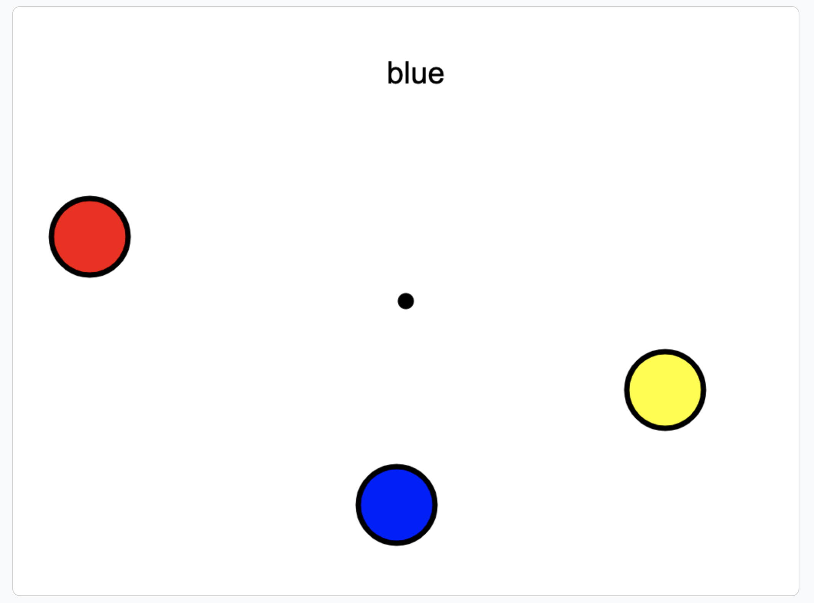

# Test technique pour Edumedia

👨‍💻 JavaScript et Canvas.

✅ Afficher le cercle le plus proche du centre, tout en pouvant bouger les cercles avec la souris.

🔗 [Page disponible sur github.io](https://tobudim.github.io/test-technique-edumedia/)

